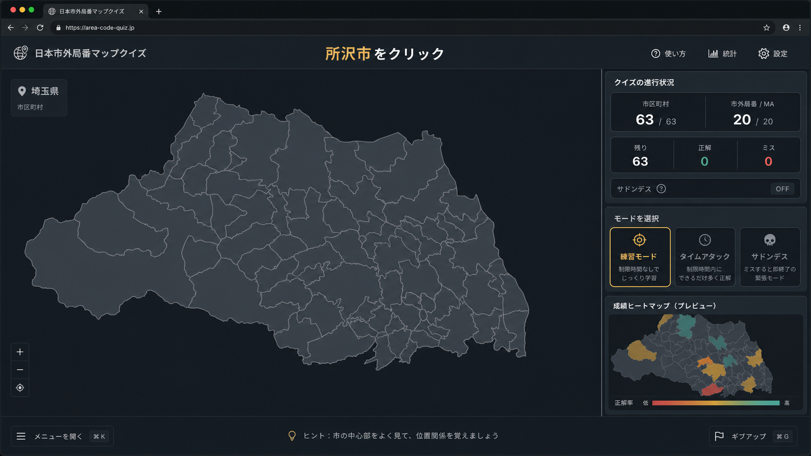

# 日本市外局番マップクイズ 企画書

作成日: 2026-05-18  
対象Phase: Phase 1 埼玉県版MVP

## 1. 企画概要

「日本市外局番マップクイズ」は、GeoGuessr向けの地域認識トレーニングに特化したスタンドアロンWebアプリである。最初の対象は埼玉県とし、市町村境界、市外局番、MAエリアを地図上で反復学習できるようにする。

通常の地理クイズではなく、高難度マップ制作、地域判別練習、大会前の弱点確認に使える「地理認識トレーニング兼リサーチツール」として設計する。

## 2. UIコンセプト

画面は暗色の教育ゲーム型UIとし、未回答の地図は情報を隠した白地図風に見せる。問題に正解したエリアだけが色付きで浮かび上がり、ラベルが表示される。ミスは一瞬赤くフラッシュし、リザルトでは弱点ヒートマップとして可視化する。

## 3. 想定ユーザー

- GeoGuessrの日本マップを高精度に練習したいプレイヤー
- 高難度・大会向けマップを作る制作者
- 市外局番、自治体境界、地域区分を覚えたい学習者
- 将来的に海外行政区画や旗・標識画像の判別訓練へ広げたいユーザー

## 4. 提供価値

- 埼玉県63市町村の位置を反復して覚えられる
- 市外局番 / MAエリアを地図上のまとまりとして記憶できる
- サドンデスにより、本番に近い緊張感で練習できる
- ミス履歴を弱点ヒートマップとJSONで確認できる
- 全国・海外・画像判別へ拡張できる基盤を初期段階から持つ

## 5. MVPスコープ

Phase 1では、埼玉県版MVPの完成を最優先する。

- 市区町村モード
- 市外局番 / MAモード
- サドンデスON/OFF
- 正解後ラベル表示
- 弱点ヒートマップ
- 弱点JSONエクスポート
- 隣接県ゴースト表示
- `index.html` ダブルクリック起動

画像判別、全国対応、永続的な成績管理、GeoGuessr用JSON出力はPhase 2以降で扱う。

## 6. 画面構成

### トップ / モード選択

カード型UIでモードを選択する。Phase 1では市区町村モード、市外局番 / MAモードを有効化し、画像判別モードは将来対応として表示のみ行う。

### 通常プレイ

上部にアプリ名、現在のモード、問題文を表示する。中央にLeaflet地図、右側または下部に残り問題数、正解数、ミス数、経過時間、サドンデス切替、リセットボタンを配置する。

### リザルト

正解数、ミス数、平均回答時間、出題数を表示する。地図は弱点ヒートマップへ切り替え、弱点JSONをダウンロードできる。

## 7. ゲーム仕様

### 市区町村モード

問題文に市町村名を表示し、該当ポリゴンをクリックする。正解するとその市町村が色付きになり、ラベルが表示される。

### 市外局番 / MAモード

問題文に市外局番またはMA名を表示し、同一MAに属する市町村ポリゴンをクリックすれば正解とする。MA境界は市町村ポリゴンを基礎に近似し、Turf.js unionで視覚的なまとまりを作る。

### サドンデス

ONの場合は1ミスで即GAME OVERとし、その時点の成績をリザルトに表示する。OFFの場合はミスを記録しながら続行する。

## 8. データ設計

市町村はGeoJSON Featureとして扱い、`id`, `name`, `prefecture`, `area_code`, `ma_name`, `region`, `tags`, `labelPoint`, `labelAngle`, `labelSize` を持たせる。

MAエリアは独立ポリゴンを前提にせず、市町村FeatureとMA対応表から生成する。境界が完全一致しないケースは将来の補正対象とし、Phase 1では市町村単位の近似で実装する。

## 9. 技術方針

- 静的HTML / CSS / JavaScriptのみで実装する
- React、Vue、Vite、Webpack、npm必須構成は禁止
- Leafletで地図描画を行う
- Turf.jsでMAエリアのunionを行う
- 実行時はローカルファイルだけで動作する
- CDN利用箇所は将来的にローカル同梱へ移行できる構造にする

## 10. 成功条件

- `index.html` をダブルクリックして起動できる
- 埼玉県の市町村ポリゴンが表示される
- ホバーとクリックで正誤判定ができる
- 未回答エリアに地名や市外局番が表示されない
- 正解後ラベルが地図左上へ飛ばない
- サドンデスが正しく機能する
- 全問終了後に弱点ヒートマップが表示される
- 弱点JSONをダウンロードできる
- 隣接県ゴーストが薄く表示され、クリック対象にならない

## 11. 拡張ロードマップ

Phase 2ではデータ構造を共通化し、都道府県やクイズモードを差し替え可能にする。Phase 3以降で関東複数県、全国市区町村、全国市外局番、県旗・市章・画像判別、海外行政区画へ広げる。

最終的には、GeoGuessr練習用の弱点分析、ヒートマップ、JSON出力、シード調整、外部ワークフロー連携まで含む地域認識トレーニング基盤を目指す。
